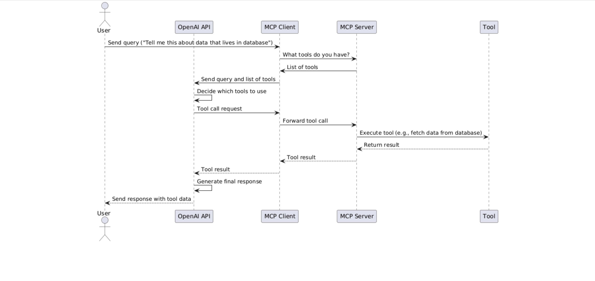

# MCP Demo Playground

This repository is a playground for experimenting with the **Model Context Protocol (MCP)** using the Python MCP SDK. The primary focus is to explore various techniques and integrations with OpenAI LLMs.

## Purpose

The goal of this experiment is to investigate how MCP can be leveraged for professional personal development, including:

- Testing and prototyping MCP workflows
- Integrating with OpenAI language models
- Evaluating different approaches for context management

## Sequential diagram showing flow of calls between client, server and openai api

## Notes

- This project is experimental and intended for learning and prototyping.
- Contributions and suggestions are welcome.

---
**Author:** Nick Joyce  
**License:** MIT